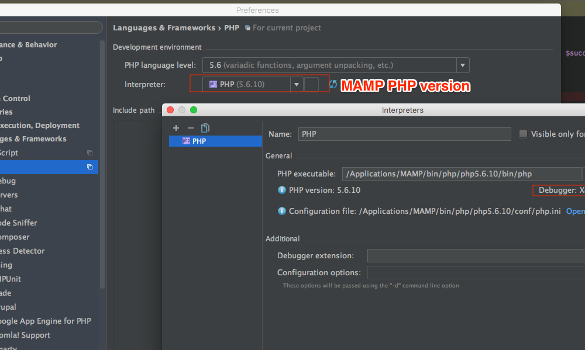
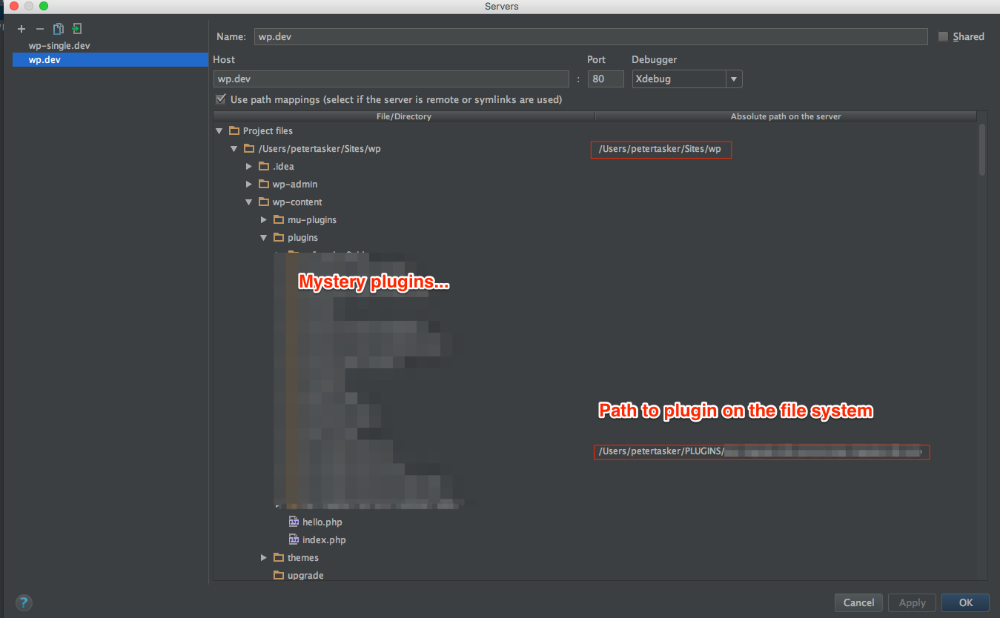

Ask any PHP developer and they’ll tell you [Xdebug](https://xdebug.org/) is the best thing since sliced bread. While true, it’s also one of the biggest pain in the asses to setup. I’ve probably set it up, in various incarnations, close to 10 times.

There’s always something that get’s me caught up and messed up. This time I decided to document how I was able to get it working *this time*, so hopefully I don’t have suffer through this again.

I followed [Michael Novotny’s post ](http://manovotny.com/setup-phpstorm-xdebug-mamp-debugging/)on this, and it *almost* works. There’s just one missing piece, for me, and that was how to handle symlinks in your plugins.

This overview assumes a few things. You’re on a recent version of OSX, you have MAMP Pro 3 installed, and you’re using PHPStorm.

**Step 0: Use the same version of PHP for your CLI *and* your webserver.**

Time and again I’ve seen people have issues with their CLI PHP version and Web server PHP version not matching up. This can cause all sorts of weirdness, especially with Xdebug, so make sure you’re using your MAMP version of PHP on your CLI.

This can be as simple as adding the MAMP PHP version to your $PATH.

In your `~/.bash_profile` file you can add something like this.

```
echo $PATH | grep -q -s "/Applications/MAMP/bin/php/php5.6.10/bin"
if [ $? -eq 1 ] ; then
export MAMP_PATH=/Applications/MAMP/bin/php/php5.6.10/bin
export PATH="$MAMP_PATH:$PATH"
fi

```

**Step 1:Make sure Xdebug is installed.**

This one’s a gimme, but still a point worth making to cover all the bases. Make sure you’ve got Xdebug running and `remote_enable=1` is set in your php.ini. There’s plenty of resources on the inter-web’s for this.

You can check if Xdebug is available, by running `php --version` in your CLI. You can further check what kind of Xdebug settings your have enabled by running `php -i | grep xdebug`

**Step 2: Setting up PHPStorm**

Make sure PHPStorm is using the same PHP Interpreter you’re using for everything else. You can set this in Preferences &gt; Languages &amp; Frameworks &gt; PHP and selecting the MAMP PHP version you’re using.



After that, essentially follow [Michael’s guide](http://manovotny.com/setup-phpstorm-xdebug-mamp-debugging/) for setting up PHPStorm with the debug configurations, once PHP is all set up.

**Step 3: Symlinks**

If you’re using plugins in your local PHP install that are symlinked (and many plugin developers do this), make sure you map those folders for Xdebug and PHPStorm! This is where I got caught many times. I even needed to map the base of my WP install, since I had checked the ‘Use path mappings’ setting.



For me, that’s all it took to get things running. Without the explicit path mappings for the symlinks, Xdebug half worked – which was *super* confusing…

I should note that if you’re running multiple sites on your MAMP install, and 2 of these sites are talking to each other in any way (via AJAX or the WP Rest API etc.), make sure ONLY ONE is running Xdebug. Not sure what the reason is, but the workaround is easy enough. Just use another version of PHP within MAMP, one that doesn’t use Xdebug.

Hope this helps someone else.