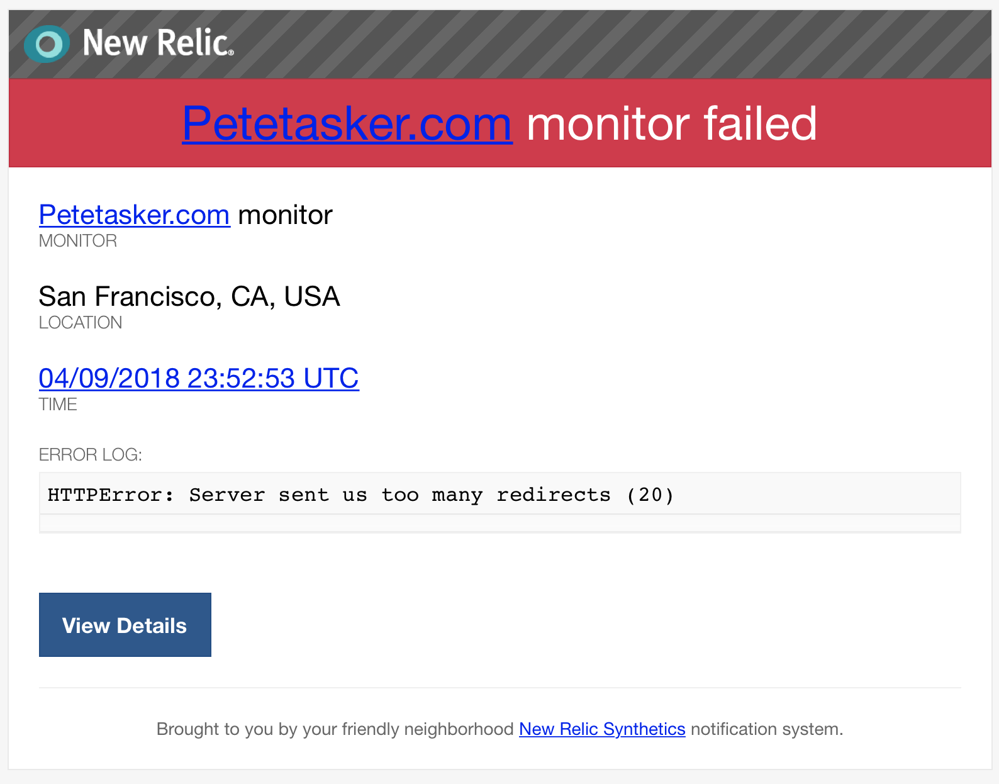

[<span style="display: inline-block; padding: 2px 3px;">Image: Simon Fitall</span>](https://unsplash.com/@simonfitall?utm_medium=referral&utm_campaign=photographer-credit&utm_content=creditBadge "Download free do whatever you want high-resolution photos from Simon Fitall")

If you pay attention to [Google and it’s indexing rules](https://fourdots.com/blog/why-you-need-ssl-to-rank-better-in-2016-and-how-to-set-it-2169), you’ve probably heard that you need an SSL certificate on your site. I’ve known this for a while and my personal site at petetasker.com wasn’t a high priority situation.

Welp, I was bored one night and decided it was about time to get one of those fancy-pants free [Let’s Encrypt](https://letsencrypt.org/) cert’s installed on my old Linode server.

There are tons of resources on the internet that outline how to get an SSL certificate installed on your site, so I’m not going to go over that portion. What I will go over is how blindly following them can take down your server…

You see, most tutorials want you to use [Certbot](https://certbot.eff.org/) to install your certificate and configure Nginx.

`certbot --nginx -d petetasker.com`

Seems harmless enough, no? That little `--nginx` flag, if you didn’t read the fine print, will modify your virtual host config. Yeah. There’s an option when setting up the certificate to redirect all HTTP traffic to HTTPS, and obviously I said ‘sure’.

And queue the redirect loop. Site monitor email deluge, Twitter ‘the site is DOWN’ DM’s…



Everything is going swimmingly!

I managed to solve this issue by removing the following block in the `/etc/nginx/sites-available/petetasker.com` virtual host declaration:

```shell
    if ($host = petetasker.com) {
       return 301 https://$host$request_uri;
    } # managed by Certbot

```

And adding a simpler redirect block, just to be *reallllly* clear, at the top of the file:

```shell
server{
        listen 80;
        server_name petetasker.com;
        return 301 https://$server_name$request_uri;
}

```

So what’s the lesson here kids? The lesson is that if you’re using a tool that will ‘automagically’ do something for you, and it sounds too good to be true, it probably is.

If you’re wondering what the final virtual host block looks like:

```shell
server{
        listen 80;
        server_name petetasker.com;
        return 301 https://$server_name$request_uri;
}
server {

        listen 80 default_server;
        #listen [::]:80 default_server ipv6only=on;
        server_name  petetasker.com www.petetasker.com;

        server_name  petetasker.com www.petetasker.com;
        root /usr/share/nginx/sites/petetasker.com;
        index index.php index.html;

        location / {
                try_files $uri $uri/ /index.php?$args;
        }

        location ~ \.php$ {
                try_files $uri =404;
                fastcgi_pass unix:/var/run/php/php7.0-fpm.sock;
                fastcgi_index index.php;
                fastcgi_param SCRIPT_FILENAME $document_root$fastcgi_script_name;
                include fastcgi_params;
        }

    listen [::]:443 ssl ipv6only=on; # managed by Certbot
    listen 443 ssl; # managed by Certbot
    ssl_certificate /etc/letsencrypt/live/petetasker.com-0001/fullchain.pem; # managed by Certbot
    ssl_certificate_key /etc/letsencrypt/live/petetasker.com-0001/privkey.pem; # managed by Certbot
    include /etc/letsencrypt/options-ssl-nginx.conf; # managed by Certbot
    ssl_dhparam /etc/letsencrypt/ssl-dhparams.pem; # managed by Certbot

}

```