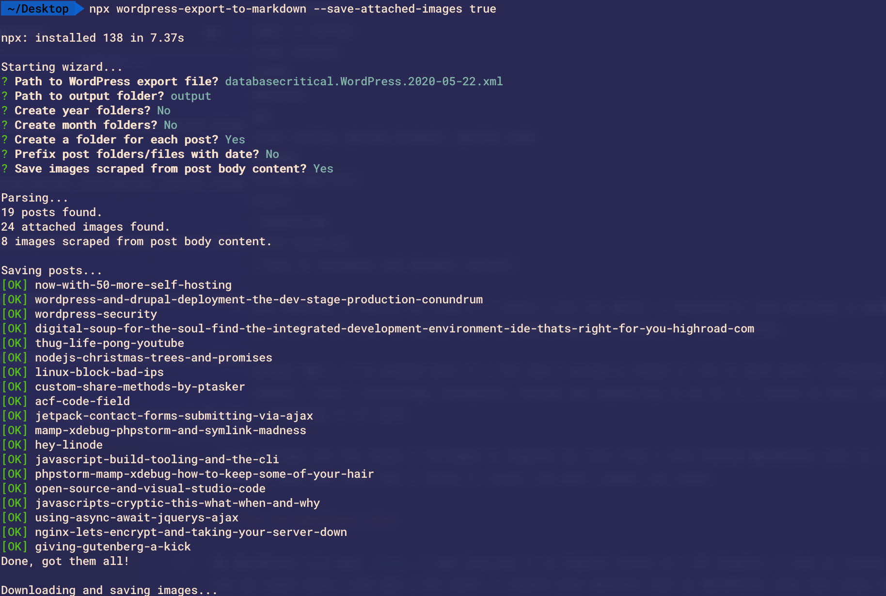
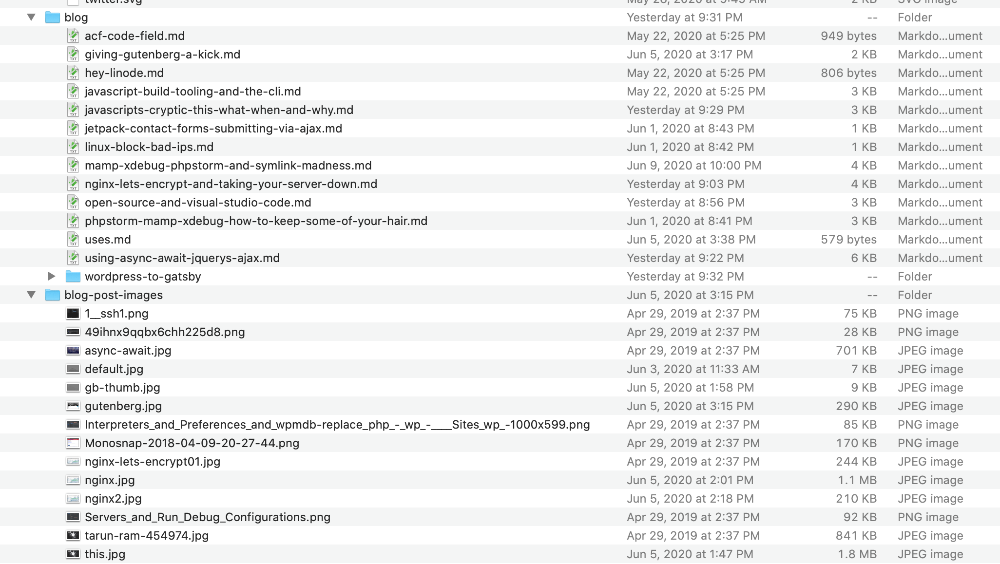

Like a lot of people, my personal website at petetasker.com was a WordPress site. I've worked with WordPress a bunch in my career and felt like it was a good balance of functionality and flexibility. But lately, I've thought about ditching it all and switching over to a static site. I personally love writing in Markdown, and the new WordPress editor relegated Markdown writing to a second class citizen. So I figured now was the time to switch over to something else entirely different, something like [Gatsby](https://www.gatsbyjs.org/).

Gatsby is a static site generator, if you're not familiar, that allows your write your templates in React and uses NodeJS under the hood to compile your site. I enjoyed building the new site: creating templates, configuring the GraphQL queries and getting back into traditional web development.
 
 At work, I've written about using WordPress as data source on [the SpinupWP blog](https://spinupwp.com/gatsby-headless-wordpress/), and I wanted to know what it would be like to switch from WordPress to a Markdown based blog.

 What follows are the steps I followed to migrate my site from a self-hosted WordPress site to a Gatsby site hosted on [Netlify](https://www.netlify.com/). It may not be the exact process that you will need to follow to migrate your own WordPress site, but I think it covers the most common steps.

## Extracting Content From WordPress

The first step to getting content out of WordPress was grabbing an XML export. This is can be done by using the WordPress core exporter. You can run create the export by logging into your wp-admin and going to Tools > Export.

Once you have an export XML file you'll need a markdown converter. There are few available online, I used the [wordpress-export-to-markdown](https://github.com/lonekorean/wordpress-export-to-markdown) script, but there's plugins and scripts like [ExitWP](https://github.com/thomasf/exitwp) availble online that do the same thing.

It's pretty straighforward to convert the XML export into Markdown. With the `wordpress-export-to-markdown` script it's really just this one command:

```shell
npx wordpress-export-to-markdown --save-attached-images true
```



After the script ran, I had a folder with a bunch of new markdown files and a folder with my media uploads. I just dumped the markdown files into a 'blog' folder and all media into a 'blog-post-images' folder. You could group each post in a folder with it's media, but I opted for this set up for the old posts to keep them separate.



The data in the Markdown files was a little mangled, but not too bad. The 'frontmatter' (the metadata for each post) was chucked in the header of the Markdown file, so a lot of the work formatting the files was removing this junk.

For the most part, the posts came across ok. There was a bit of formatting and styling needed in terms of `<code>` and `<pre>` tags, as well as fixing up image paths. Other than than, most formatting was in pretty good shape!

`#winning`

## Getting Gatsby up and running

Alright, so now we've got out WordPress content, now what? Welp, the first thing we have to do is get Gatsby up and running. Fortunately this is pretty easy and the [Gatsby docs](https://www.gatsbyjs.org/docs/) are very helpful.

```shell
// Install the gatsby cli tool globally
npm install -g gatsby-cli

// Create a new Gatsby site in a 'gatsby-starter-blog' folder
gatsby new gatsby-starter-blog https://github.com/gatsbyjs/gatsby-starter-blog

```

I opted to use the [Gatsby Starter Blog](https://github.com/gatsbyjs/gatsby-starter-blog) _starter_ as it already has a lot of the Markdown plugins included, as well as some pretty decent defaults and app structure.

In Gatsby land, starters as pre-built boilerplates, and it's really awesome how far they can get you right out of the box. There are a bunch of options for pretty much any design style you could ask for. Think of starters as a WordPress theme _and_ set of plugins.

Gatsby does have the [concept of themes](https://www.gatsbyjs.org/docs/themes/what-are-gatsby-themes) as well, but for most smaller sites a starter is just fine. The only thing you lose by using a starter over a theme is that if the starter is updated down the road you'll have no way to pull in any upstream changes.

For me, that's a solid "meh".

Once you've run `gatsby new`, you'll have a pretty nice Gatsby app ready to go. If you `cd` into 'gatsby-starter-blog' and run `gatsby develop` you should see your new blog running at http://localhost:8000. And at this point, if you've moved your markdown files into the 'content/blog' folder, they should have been created as Gatsby posts.

How'd that happen?

## How Gatsby Works

If you're coming from WordPress land, the concept of a 'compiled' website might seem a little strange. That's what Gatsby does, it compiles a dynamic site (React components and a content source) into a (mostly) static website. Because of this compilation step, most of the magic happens during the build step. 

Before we get into the build side of things, it's helpful to see how the content and structure of the site is created.

The first thing to learn about is the [`gatsby-config.js` file](https://www.gatsbyjs.org/docs/gatsby-config/). This is where we load in our Gatsby plugins and configuration. For our Markdown files, we use the `gatsby-source-filesystem` plugin to load them in, specifying the path in the configuration:

```javascript
{
    resolve: `gatsby-source-filesystem`,
    options: {
    path: `${__dirname}/content/assets`,
    name: `assets`,
    },
},
```

The Gatsby starter will have this file mostly populated out of the gate, but it's good to know it's purpose and location.

## Gatsby Node APIs

The next thing to learn about are the [Gatsby Node APIs](https://www.gatsbyjs.org/docs/node-apis/). These are managed the `gatsby-node.js` file. In here, we define how pages get created and how they interface with the [GraphQL](https://www.gatsbyjs.org/docs/graphql-concepts/) layer.

The main function to create pages is the called, unironicly, [`createPages()`](https://www.gatsbyjs.org/docs/node-apis/#createPages). In here we define the query to get our posts, and any additional data we want to add to our posts/pages. We then call the [`createPage()`](https://www.gatsbyjs.org/docs/actions/#createPage) function for each 'post' we want created.

It's important to note that `gatsby-node.js` file is essentially just a node script with access to the Gatsby APIs. This is helpful information if you're debugging during the build process, you can [debug the Gatsby build ste](https://www.gatsbyjs.org/docs/debugging-the-build-process/) just as you would any other Node script.

In this file, we import a template to use when the `createPage()` function is called a bit later.

    const blogPost = path.resolve(`./src/templates/blog-post.js`)

Then, we have our GraphQL query which is saved in the `postsResult` variable. We use the `graphql` function which is part of the Gatsby package;

```javascript
const postsResult = await graphql(
`
    {
        allMarkdownRemark(
            sort: { fields: [frontmatter___date], order: DESC }
            limit: 1000
        ) {
        edges {
            node {
            fields {
                slug
            }
            frontmatter {
                title
                type
            }
            }
        }
        }
    }
`
)
```

`allMarkdownRemark` is a function that's part of the [`gatsby-transformer-remark` plugin](https://www.gatsbyjs.org/packages/gatsby-transformer-remark/) and is Gatsby's port of the [Remark](https://remark.js.org/) markdown parser. In the `gatsby-config.js` file we've already configured this plugin so it knows where to find our Markdown files.

Gatsby also has a [great overview](https://www.gatsbyjs.org/docs/graphql-concepts/#understanding-the-parts-of-a-query) explaining what GraphQL is and why it's so cool. 

All we need to know about the above query is that it gets all of our content from our markdown files, sorted by date and limited to 1000.

The neat thing about GraphQL is that is returns data in the _same format_ as we request it. So we can access data in the `postsResult` variable like we would any other JS object.

So in our query we're asking for:

```json
{
    allMarkdownRemark(
        sort: { fields: [frontmatter___date], order: DESC }
        limit: 1000
    ) {
        edges {
            ...
        }
}
```

And in the `postsResult` var:

```javascript
// Create blog posts pages.
const posts = postsResult.data.allMarkdownRemark.edges
```

You can think of GraphQL queries as similar to [WordPress custom `WP_Query()` calls](https://www.smashingmagazine.com/2013/01/using-wp_query-wordpress/). We specify what we want, and it returns the data.

```php
<?php
   $args = array(
      'post_status' => 'future',
      'meta_query' => array(
         array(
            'key' => '_thumbnail_id',
            'value' => ’,
            'compare' => '!='
         )
      )
   );
   $slider_posts = new WP_Query($args);
?>

<?php if($slider_posts->have_posts()) : ?>

<div class='slider'>
   <?php while($slider_posts->have_posts()) : $slider_posts->the_post() ?>
      <div class='slide'>
         <?php the_post_thumbnail() ?>
      </div>
   <?php endwhile ?>
</div>

<?php endif ?>
?>
```
_Example of getting posts for a 'slider'_

Just like in WordPress, the last thing to do is loop over all the posts and apply our HTML:

```javascript
  const posts = postsResult.data.allMarkdownRemark.edges

  posts.forEach((post, index) => {
    let previous, next

    const { node } = post

    // Figure out links for previous and next post
    if (node.frontmatter.type === "post") {
      previous = index === posts.length - 1 ? null : posts[index + 1].node
    }

    if (node.frontmatter.type === "post") {
      next = index === 0 ? null : posts[index - 1].node
    }

    //Actually create the page
    createPage({
      path: post.node.fields.slug, //Post 'slug'
      component: blogPost, // Template to render
      context: { //Context date for this post/page
        slug: post.node.fields.slug,
        previous,
        next,
      },
    })
  })
```

In a WordPress theme, you would probably just output some HTML inside the loop. In Gatsby, since this is during the build step, you need to explicitly call the `createPage()` function to create the page on our site.

The `createPage()` function uses our React component (`blogPost.js`) as the template. Just like WordPress uses individual theme component files to output parts of our theme, the `createPage()` function grabs our template and injects the data needed to render out everything.

The [`blogPost.js` template](https://github.com/ptasker/petetasker.com/blob/master/src/templates/blog-post.js) isn't super complex, it's just a React component with dynamic data passed in.

I'll defer to the [Gatsby docs](https://www.gatsbyjs.org/tutorial/part-seven/) for explaining how templates work.

Things also differ from the traditional WordPress development workflow when it comes to images.

## Image Handling

We've seen so far that Gatsby uses GraphQL to query content for our posts, but how are images handled? Images in Gatsby require the [`gatsby-image`](https://www.gatsbyjs.org/packages/gatsby-image/) plugin.

`gatsby-image` is a pretty sweet little package. It will take your large images, resize them, strip metadata, lazy load them and use a 'SVG blurred placeholder' all in one.

Yeah.

[Per the docs](https://www.gatsbyjs.org/packages/gatsby-image/#install), it's basically just installing a couple npm packages and adding some base configuration to your `gatsby-config.js` file.

Then, you have a few options for how to use the image in your template and your posts.

For markdown, you just use the markdown syntax for images, and use a relative path to the image:

    

In a component, you can query for an image with a GraphQL like so:

```js
query BioQuery {
    avatar: file(absolutePath: { regex: "/profile-pic.png/" }) {
        childImageSharp {
            fixed(width: 50, height: 50) {
                ...GatsbyImageSharpFixed
            }
        }
    }
`)
```

Then elsewhere, use the `gatsby-image` `Image` component to render it.

```javascript
<Image
    fixed={data.avatar.childImageSharp.fixed}
    alt={author.name}
    imgStyle={{
        borderRadius: `50%`,
    }}
/>
```

It seems a lot more complicated than what you would need to do in a WordPress theme, but I find it only slightly more verbose than this:

```php
" alt="Alt text" >
```

I'd argue that the biggest improvement over WordPress is Gatsby's image handling. Having the correct sizes created automatically and having them lazy-loaded is a game changer. It requires next to no effort and everything is super performant out of th box.

# winning

Ok, so let's review:

1. ✅ We've exported our WordPress site content to Markdown
2. ✅ We've exported our media
3. ✅ We've created a new Gatsby site that loads our markdown files

We also understand how image handling is a bit different in Gatsby.

All that's left is deployment and hosting!

## Deployment and Hosting

One of the sticking points with WordPress is finding a decent host. Most managed hosts can get expensive fairly quickly, and shared hosting is a no-go if you want decent performance. You can self host on a virtual server as I did for years, but you have to keep the underlying OS up to date and patch things, modify the firewall etc. etc. etc. (plug: [SpinupWP from Delicious Brains](https://spinupwp.com/) mitigates all of these issues 🤩).

Does hosting Gatsby have the same issues? In a word, no.

Because Gatsby compiles down to _essentially_ a static HTML web site, you can host almost anywhere. Theres' no dynamic content, so it's pretty quick right out of the box. Even more, [Netlify](https://www.netlify.com/) offers free hosting of Gatsby sites, including [Let's Encrypt SSL certificates](https://letsencrypt.org/) and custom domains. That's where I'm hosting this site and it's the bees knees.

I've also set up git deployments, so pushing to master deploys the site. 

#WINNING 3

## Where WordPress is better

Ok, so all this sounds pretty great doesn't it? Well it is, and Gatsby _is_ awesome, but it's not without issues.

Gatsby isn't a CMS, so none of the CMS nice things are available. Want to handle a contact form? That's an external service. Want comments on your blog post? That's an external service. Want to sell stuff or have user sessions? That's an external...

You get the point.

It's a static site, so it's a static site. There's no dynamic aspect to the site, everything is built at compile time. That's probably the biggest drawback of Gatsby, there's no 'dynamic' functionality on your site by default.

Of course, there are workarounds and services that will get you this interactivity, but it involves weaving together third party services, like Disqus or Shopify.

I've got Disqus comments enabled (leave a comment!) and use Netlify's form handling for my contact form. But if you've got a highly dynamic site with dynamic content, Gatsby is probably a no-go.

WordPress on the other hand is dynamic by default, so you can get pretty far with plugins and custom code.


